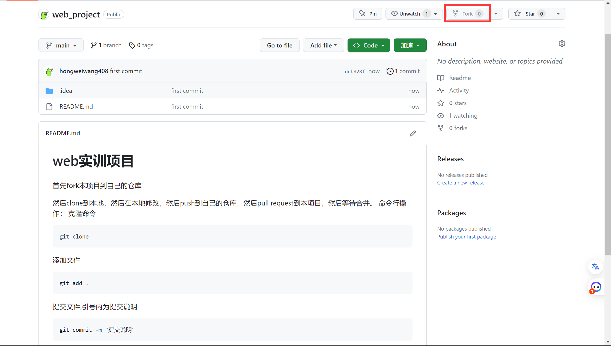
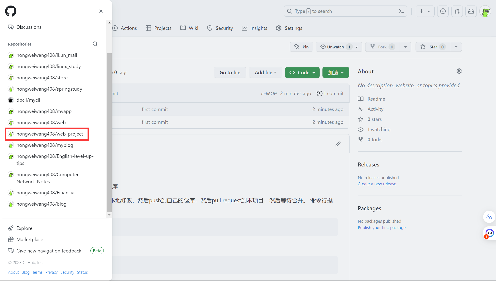
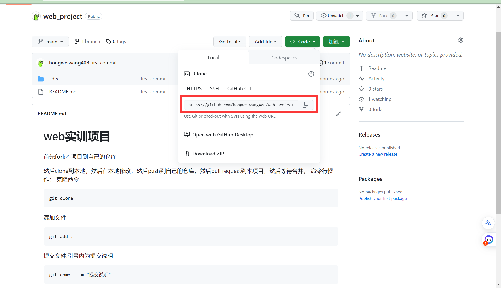

# web实训项目
 首先**fork**本项目到自己的仓库
 
点击自己仓库fork的代码

然后clone到本地
 

```
git clone 仓库地址
```
然后在本地修改,然后push到自己的仓库

push命令行操作：
克隆命令

添加文件
```
git add .
```
提交文件,引号内为提交说明
```
git commit -m "提交说明"
```
推送到远程仓库
```
git push
```

然后在自己的仓库点击pull request
